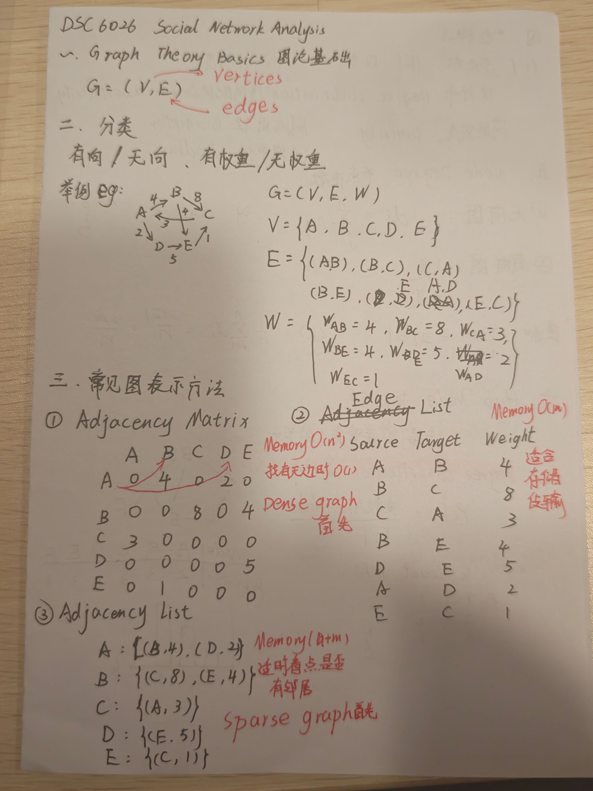
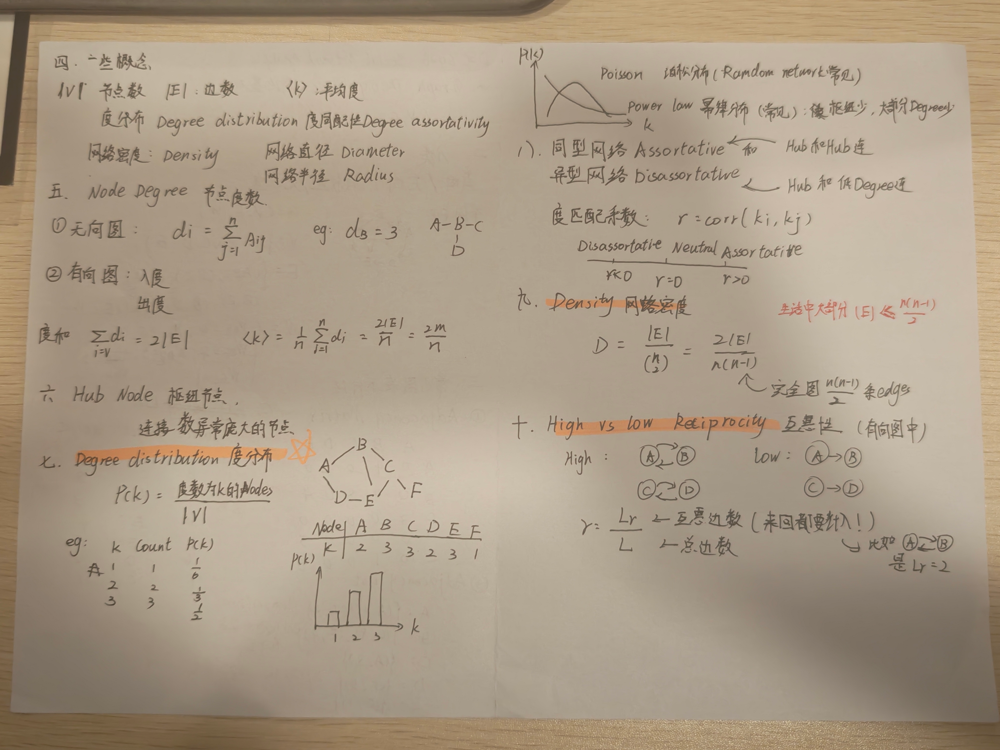
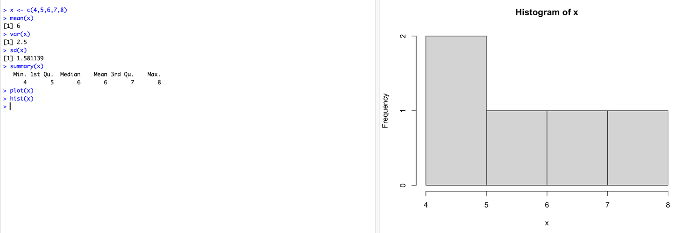
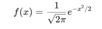

# DSC6026 Social Network Analysis — Week 1

Date: 2026-09-06

## Topics

- Graph theory basics
- Directed / undirected networks
- Weighted / unweighted networks
- Adjacency Matrix
- Adjacency List
- Edge List
- Node Degree
- Hub Nodes
- Degree Distribution
- Degree Assortativity
- Network Density
- Reciprocity

## Handwritten Notes

### Page 1

### Page 2



## Key Takeaways

1. A graph can be represented as `G = (V, E)` or `G = (V, E, W)` for a weighted graph.
2. Adjacency Matrix, Adjacency List and Edge List are different representations of the same network.
3. Degree describes how many connections a node has.
4. Degree distribution describes how node degrees are distributed across the network.
5. Assortativity measures whether nodes with similar degrees tend to connect.
6. Density describes how many of all possible edges actually exist.
7. Reciprocity measures mutual connections in directed networks.

## One Sentence Summary

Network analysis is not only about individual nodes, but also about how relationships and network structure shape the system.

## R basic knowledge

> 今日主线：创建一组数据 → 用统计函数概括数据 → 区分正态分布的密度与累计概率 → 生成坐标并画图。
>
> 以下根据原始记录整理；函数解释、数值示例和自测题为复习补充。

### 1. 创建向量与赋值

```r
x <- c(4, 5, 6, 7, 8)
```

- `c()`：将多个值组合成一个向量（vector），可以先理解为一组有顺序的数据。
- `<-`：赋值，把右边的结果保存到左边的变量名中。
- `x`：变量名，后续可以直接用它进行计算或绘图。

### 2. 基本统计函数

对于 `x <- c(4, 5, 6, 7, 8)`：

| 函数 | 用途 | 本例结果 |
| --- | --- | --- |
| `mean(x)` | 平均数：数据的平均水平 | `6` |
| `var(x)` | 样本方差：数据的分散程度 | `2.5` |
| `sd(x)` | 样本标准差：方差的平方根 | 约 `1.581139` |
| `summary(x)` | 对这个数值向量给出六项概括统计 | 见下方 |

```r
mean(x)
var(x)
sd(x)
summary(x)
```

`summary(x)` 的输出：

| Min. | 1st Qu. | Median | Mean | 3rd Qu. | Max. |
| --- | --- | --- | --- | --- | --- |
| 最小值 | 第一四分位数 | 中位数 | 平均数 | 第三四分位数 | 最大值 |
| 4 | 5 | 6 | 6 | 7 | 8 |

**易错点：** `var(x)` 使用样本方差，分母为 `n - 1`。本例离均差平方和为 `4 + 1 + 0 + 1 + 4 = 10`，因此方差为 `10 / 4 = 2.5`。`sd(x)` 等于 `sqrt(var(x))`。

### 3. 初步绘图：`plot()` 与 `hist()`

```r
plot(x)
hist(x)
```

| 写法 | 图中展示什么 | 用途 |
| --- | --- | --- |
| `plot(x)` | 对这个数值向量，横轴为元素序号 `1:5`，纵轴为数值 `4:8` | 看数值如何随顺序变化 |
| `hist(x)` | 横轴为数值区间，默认纵轴为各区间中的数据个数（频数） | 看数据集中在哪些范围 |

**课堂截图：**



### 4. 正态分布的四个常用函数

先区分两个问题：**曲线在某一点有多高？** 与 **落在某个值左侧的概率有多大？**

- **概率密度（PDF）**：密度曲线的高度；曲线下某个区间的面积才是落入该区间的概率。
- **累计分布函数（CDF）**：给出 `P(X <= x)`，即随机变量不超过 `x` 的概率。

原笔记中的公式是**标准正态分布的概率密度函数**，对应 `dnorm(x)`：



下面的例子均采用默认参数 `mean = 0, sd = 1`，即标准正态分布。

| 函数 | 输入 → 输出 | 例子 | 如何理解 |
| --- | --- | --- | --- |
| `dnorm(x)` | 数值 → 概率密度 | `dnorm(0)` ≈ `0.3989` | 密度曲线在 `0` 处的高度 |
| `pnorm(q)` | 数值 → 累计概率 | `pnorm(0)` = `0.5` | `P(X <= 0) = 0.5` |
| `qnorm(p)` | 累计概率 → 对应分位点 | `qnorm(0.975)` ≈ `1.96` | 约 97.5% 的概率在 `1.96` 左侧 |
| `rnorm(n)` | 样本数量 → 随机生成的数值 | `rnorm(5)` | 从正态分布中随机抽取 5 个值 |

```r
dnorm(0)       # 概率密度，约 0.3989
pnorm(1.96)    # 左侧累计概率，约 0.975
qnorm(0.975)   # 根据累计概率反查位置，约 1.96
rnorm(5)       # 生成 5 个随机数，结果通常每次不同
```

记忆方法：`d` = density（密度），`p` = probability（累计概率），`q` = quantile（分位点），`r` = random（随机生成）。

**易错点：** `dnorm(0)` 不是 `P(X = 0)`。正态分布是连续分布，落在某个精确单点的概率为 `0`；概率要通过区间面积来理解。

### 5. `seq()`：创建等差数列

```r
x <- seq(-2, 2, by = 0.1)
```

- `-2`：起点。
- `2`：终点。
- `by = 0.1`：每一步增加 `0.1`。
- 本例得到从 `-2` 到 `2` 的 41 个点，用作画图时的横坐标。

注意：这里重新给 `x` 赋值，覆盖了前面 `c(4, 5, 6, 7, 8)` 的内容。

### 6. 画标准正态分布的累计概率曲线

```r
x <- seq(-2, 2, by = 0.1)
y <- pnorm(x)

plot(
  x, y,
  type = "l",
  xlab = "x",
  ylab = expression(Phi(x)),
  main = "Standard Normal CDF"
)
```

也可以省略变量 `y`，直接使用原来的写法：

```r
plot(x, pnorm(x), type = "l", xlab = "x",
     ylab = expression(Phi(x)), main = "Standard Normal CDF")
```

**代码如何工作：**

1. `seq()` 生成一组横坐标。
2. `pnorm(x)` 对向量中的每一个值计算累计概率，返回同样长度的纵坐标向量。这就是向量化计算，这里不需要自己写循环。
3. `plot()` 将每一对 `(x, y)` 画出来，再按顺序连接。

| 参数或表达式 | 含义 |
| --- | --- |
| `x, pnorm(x)` | 横坐标，以及对应的累计概率 |
| `type = "l"` | 小写字母 `l`（line），用线段连接相邻点 |
| `xlab = "x"` | 横轴标题 |
| `ylab = expression(Phi(x))` | 将纵轴标题显示为数学符号 `Φ(x)`；只控制标签，不参与概率计算 |
| `main = "Standard Normal CDF"` | 图表标题：标准正态分布的累计分布函数 |

**读图要点：** CDF 呈递增的 S 形，经过 `(0, 0.5)`。这里仅画了 `[-2, 2]`，两端的累计概率约为 `0.0228` 和 `0.9772`，并没有到达 `0` 和 `1`。

**原笔记纠正：** 函数名是 `pnorm()`，不是 `pnom()`。它将每个 `x` 转换成左侧累计概率 `P(X <= x)`；若想画钟形的密度曲线，应使用 `dnorm(x)`。

### 7. 复习自测

1. `plot(x)` 与 `hist(x)` 的横轴分别表示什么？
2. `var(x)` 与 `sd(x)` 有什么关系？
3. 求 `P(X <= 1.96)` 应使用哪个函数？已知累计概率 `0.975`，反查数值应使用哪个函数？
4. 将绘图代码中的 `pnorm(x)` 换成 `dnorm(x)` 后，图形和纵轴含义如何变化？（图标题和纵轴标签也应相应修改。）

**一句话复习：** 用 `c()` 或 `seq()` 创建数据，用 `mean()` 等函数概括数据；正态分布中，`d` 查密度、`p` 查累计概率、`q` 反查分位点、`r` 生成随机数，再用 `plot()` 将结果画出来。
